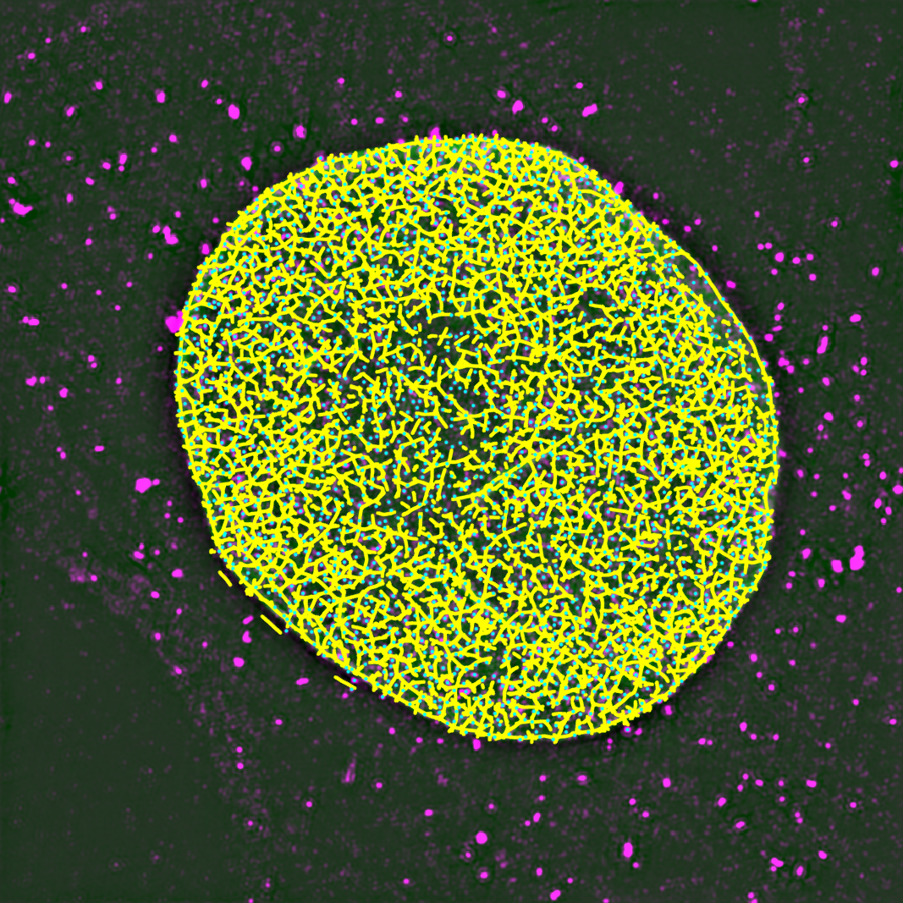

# Lamin-NPC Analysis
Sub-pixel Analysis of Lamin Fibers and Nuclear Pore Complexes

The repository is meant to support "[Nuclear Lamins A/C and B1 Provide a Structural Framework That Organizes and Anchors Nuclear Pore Complexes](https://doi.org/10.1101/2020.04.03.022798)" by Mark Kittisopikul, Takeshi Shimi, Meltem Tatli, Joseph R. Tran, Yixian Zheng, Ohad Medalia, Khuloud Jaqaman, Stephen A. Adam, and Robert D. Goldman currently available as a preprint on bioRxiv.

## Abstract

Nuclear lamin isoforms assemble into fibrous meshworks within the nuclear lamina (NL) where they are   associated with nuclear pore complexes (NPCs). Although the lamins and NPCs are major components of the nuclear envelope (NE), little is known about their structural relationships. We used 3D structured illumination microscopy (3D-SIM) and sub-pixel image analysis to show that NPCs are closely associated with lamin fibers in mouse embryonic fibroblasts (MEFs). When lamin A/C (LA/C) or lamin B1 (LB1) are removed by gene knockout, the NPCs retained their association and redistributed with the resulting enlarged lamin meshworks. Cryo-ET revealed that more LA/C than LB1 fibers contacted the nucleoplasmic ring of NPCs. Knockdown of the outer ring nucleoporin ELYS induced NPC clusters that excluded LA/C fibers.  Knockdown of the basket nucleoporin TPR reduced the size of LA/C, LB1, and LB2 meshworks while retaining their close association with NPCs. NUP153 knockdown reduced LA/C and LB2 meshwork size in wild type (WT) MEFs. Therefore, lamins and nucleoporins act together to maintain the organization and distribution of lamin meshworks and NPCs.

## Software Synopsis

High-resolution microscopy imaging sampled beyond the critical Nyquist requirements allows for interpolation to create a continuous image. Features that describe biological complexes such as nuclear pore complexes (NPCs) and lamin isoform fibers can be extracted in a continuous manner without having to round to the nearest pixel. By employing convolutional filtering, we find the centers of NPCs and lamin fibers by locating local maxima within the continuous image in two distinct channels. This enables the measurement of distances between the centers to high precision, albeit with localization error. The localization error can be averaged out by looking at distributions of measurements and drawing conclusions by using statistics to compare the distributions. To evaluate the relationship between NPCs and lamins, we measure these distributions and compare them to them to controls. These controls include the expected distribution if no relationship existed between the NPCs and lamin fibers as well as biological controls.

To locate lamin fibers, this software package uses Adaptive Resolution Orientation Space software. That software written for this analysis allows for the detection of fiber orientation which then enables subpixel localization of the fiber centers.

To locate NPCs, 2D local maxima detection is used based on point source detectors along with Gaussian unmixing.

## Usage

1. Download the repository zip file or use git clone
2. Open MATLAB version R2017A or later
3. Run performAnalysis.m
4. Select All Files (*.*) to view all files in the file dialog
5. Select a microscopy image file
6. Use the "movie" viewer to examine the auto-focus selection and assign channels to lamins or NPCs via the dialog box
7. Press OK

## Dependencies

* MATLAB R2017A+
    * Image Processing Toolbox
    * Statistics and Machine Learning Toolbox
    * Parallel Computing Toolbox
    * MATLAB Distributed Computing Server
* [AdaptiveResolutionOrientationSpace](https://github.com/mkitti/AdaptiveResolutionOrientationSpace)

## Status

This software release is a work-in-progress.

## License

     laminNPCAnalysis - Analyze Lamin Fibers and Nuclear Pore Complexes
     Copyright (C) 2020 Mark Kittisopikul, Northwestern University
 
     This program is free software: you can redistribute it and/or modify
     it under the terms of the GNU General Public License as published by
     the Free Software Foundation, either version 3 of the License, or
     (at your option) any later version.
 
     This program is distributed in the hope that it will be useful,
     but WITHOUT ANY WARRANTY; without even the implied warranty of
     MERCHANTABILITY or FITNESS FOR A PARTICULAR PURPOSE.  See the
     GNU General Public License for more details.
 
     You should have received a copy of the GNU General Public License
%     along with this program.  If not, see <https://www.gnu.org/licenses/>.
